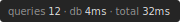

# django-devbar

Lightweight performance devbar for Django. Shows DB query count, query duration, and response time.



## Installation

```bash
pip install django-devbar
```

Add to your middleware:

```python
MIDDLEWARE = [
    "django_devbar.DevBarMiddleware",
    # ...
]
```

## Configuration

```python
# Position: bottom-right, bottom-left, top-right, top-left (default: bottom-right)
DEVBAR_POSITION = "top-left"

# Show HTML overlay (default: DEBUG)
DEVBAR_SHOW_BAR = True

# Add X-DevBar-* response headers (default: False)
DEVBAR_SHOW_HEADERS = True
```

## Response Headers

When `DEVBAR_SHOW_HEADERS = True`:

- `X-DevBar-Query-Count` - Number of DB queries
- `X-DevBar-Query-Duration` - Total DB time in ms
- `X-DevBar-Response-Time` - Total response time in ms
- `X-DevBar-Duplicates` - Present if duplicate queries detected
